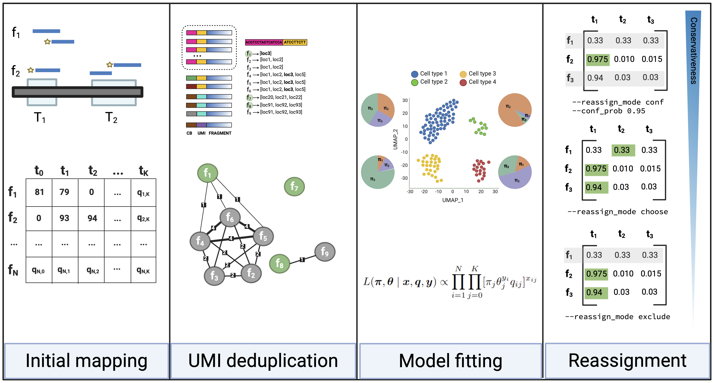

Stellarscope
========

###### Nixon Lab, Weill Cornell Medicine

## Single-cell Transposable Element Locus Level Analysis of scRNA Sequencing

#### Citation

[__*A single-cell transposable element atlas of human cell identity*__](https://pubmed.ncbi.nlm.nih.gov/40543500/)

Helena Reyes-Gopar, Jez L. Marston, Bhavya Singh, Matthew Greenig, Jonah Lin, Mario A. Ostrowski, Kipchoge N. Randall Jr., Santiago Sandoval-Motta, Nicholas Dopkins, Elsa Lawrence, Morgan M. O’Mara, Tongyi Fei, Rodrigo R. R. Duarte, Timothy R. Powell, Enrique Hernández-Lemus, Luis P. Iñiguez, Douglas F. Nixon, Matthew L. Bendall

Cell Reports Methods; doi: https://doi.org/10.1016/j.crmeth.2025.101086 

### [Stellarscope Tutorial](docs/protocol.md)
