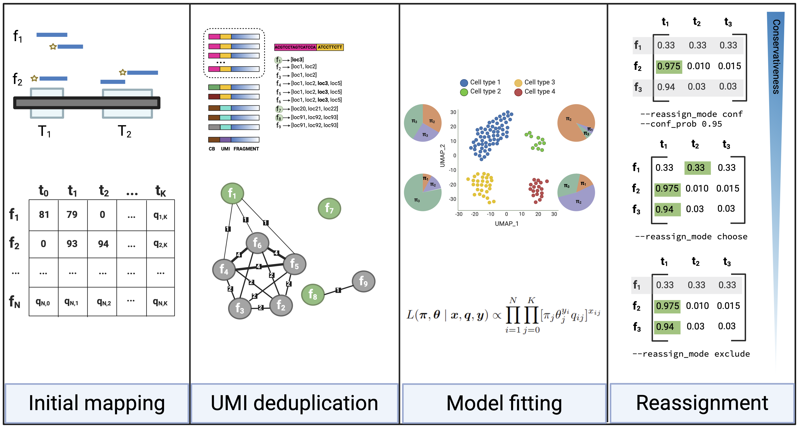

[](https://anaconda.org/bioconda/stellarscope)
[](https://bioconda.github.io/recipes/stellarscope/README.html)
[](https://github.com/nixonlab/stellarscope/stargazers)

Stellarscope
========

## _Single-cell Transposable Element Locus Level Analysis of scRNA Sequencing_



### [__*A single-cell transposable element atlas of human cell identity*__](https://pubmed.ncbi.nlm.nih.gov/40543500/)

Helena Reyes-Gopar, Jez L. Marston, Bhavya Singh, Matthew Greenig, Jonah Lin, Mario A. Ostrowski, Kipchoge N. Randall Jr., Santiago Sandoval-Motta, Nicholas Dopkins, Elsa Lawrence, Morgan M. O’Mara, Tongyi Fei, Rodrigo R. R. Duarte, Timothy R. Powell, Enrique Hernández-Lemus, Luis P. Iñiguez, Douglas F. Nixon, Matthew L. Bendall

_Cell Reports Methods_. doi:[10.1016/j.crmeth.2025.101086](https://doi.org/10.1016/j.crmeth.2025.101086) 


## Installation

[](http://bioconda.github.io/recipes/stellarscope/README.html)

### Prerequisites:

We recommend using the `mamba` package and environment management system,
a reimplementation of `conda`.

+ [Install mamba](https://mamba.readthedocs.io/en/latest/installation/mamba-installation.html) (_recommended_)
+ [Install conda](https://docs.conda.io/projects/conda/en/latest/user-guide/install/index.html)

Bioconda lets you install thousands of software packages related to biomedical research using the conda package manager.

+ [One-time setup of bioconda](https://bioconda.github.io/#usage)

### Install with bioconda:

Given that you already have a conda environment in which you want to have this package, install with:

```bash
   mamba install stellarscope
```

To create a new environment, run:

```
mamba create --name myenvname stellarscope
```

with `myenvname` being a reasonable name for the environment.


### Tutorials

+ [Stellarscope Tutorial](docs/protocol.md) by Helena Reyes Gopar (@hreypar)

### License

This project is licensed under the MIT License - see the [LICENSE](LICENSE) file for details.

### Contributors

This project was developed in the Nixon Lab at Weill Cornell Medicine.

Funding for Stellarscope comes from US National Institutes of Health (NIH) 
grants CA260691, CA206488, R21HG011513, R56AG078970, and UM1AI164559.

A special thanks to everyone who has contributed to this project.

Stellarscope is maintained by:

  + Nixon Lab (Institute of Translational Research, The Feinstein Institutes for Medical Research, Manhasset, NY, United States)
  + Bendall Lab (Computational Biology Institute, Department of Biostatistics and Bioinformatics, Milken Institute School of Public Health, The George Washington University, Washington, DC, United States)

---

Questions and comments are welcome and should be sent to our
[stellarscope discussions](https://github.com/nixonlab/stellarscope/discussions)
page. Report software issues and bugs on the
[issues](https://github.com/nixonlab/stellarscope/issues)
page.

